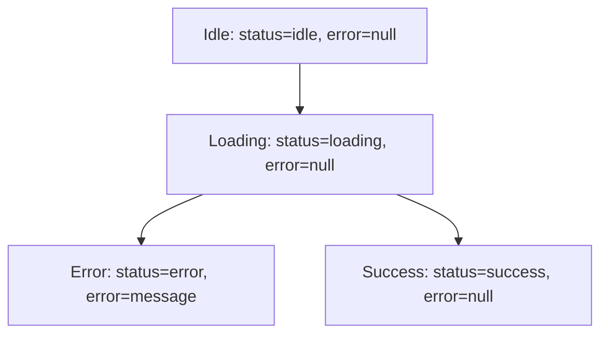

# Migration Guide: Expo App to Clean Architecture with Redux

This guide will help you migrate an existing Expo app to this clean architecture pattern using Redux as the application core, Event-Driven Architecture (EDA), and Vertical Slices.

## Table of Contents

1. [Prerequisites](#prerequisites)
2. [Phase 1: Setup Redux Infrastructure](#phase-1-setup-redux-infrastructure)
3. [Phase 2: Choose Your First Feature](#phase-2-choose-your-first-feature)
4. [Phase 3: Create State Model](#phase-3-create-state-model)
5. [Phase 4: Create Events](#phase-4-create-events)
6. [Phase 5: Create Reducer](#phase-5-create-reducer)
7. [Phase 6: Create Repository Interface](#phase-6-create-repository-interface)
8. [Phase 7: Write Tests (TDD)](#phase-7-write-tests-tdd)
9. [Phase 8: Implement Use Case](#phase-8-implement-use-case)
10. [Phase 9: Connect UI](#phase-9-connect-ui)
11. [Phase 10: Migrate Additional Features](#phase-10-migrate-additional-features)
12. [Migration Checklist](#migration-checklist)

---

## Prerequisites

### Install Dependencies

```bash
npm install @reduxjs/toolkit react-redux
npm install --save-dev @types/react-redux
```

### Configure TypeScript Path Alias

Add to your `tsconfig.json`:

```json
{
  "compilerOptions": {
    "paths": {
      "@/*": ["./*"]
    }
  }
}
```

Add to `babel.config.js`:

```javascript
module.exports = function (api) {
  api.cache(true);
  return {
    presets: ['babel-preset-expo'],
    plugins: [
      [
        'module-resolver',
        {
          root: ['./'],
          alias: {
            '@': './',
          },
        },
      ],
    ],
  };
};
```

Install the babel plugin:

```bash
npm install --save-dev babel-plugin-module-resolver
```

---

## Phase 1: Setup Redux Infrastructure

### Step 1.1: Create Directory Structure

```
src/
  shared/
    application/
      root.store.ts
      root.reducer.ts
      root.state.ts
      thunk.type.ts
      test/
        test.store.ts
```

### Step 1.2: Create Thunk Type Definition

Create `src/shared/application/thunk.type.ts`:

```typescript
import { ThunkAction } from "@reduxjs/toolkit";
import { RootState } from "@/src/shared/application/root.state";
import { Container } from "@/src/shared/application/root.store";

export type Thunk<ReturnType = void> = ThunkAction<
  ReturnType,
  RootState,
  Container,
  any
>;
```

### Step 1.3: Create Root State

Create `src/shared/application/root.state.ts`:

```typescript
import rootReducer from "@/src/shared/application/root.reducer";

export type RootState = ReturnType<typeof rootReducer>;
```

### Step 1.4: Create Root Reducer (Empty for Now)

Create `src/shared/application/root.reducer.ts`:

```typescript
import { combineReducers } from "@reduxjs/toolkit";

// We'll add reducers here as we migrate features
const rootReducer = combineReducers({
  // Example: exercices: exerciceReducer,
});

export default rootReducer;
```

### Step 1.5: Create Root Store

Create `src/shared/application/root.store.ts`:

```typescript
import { configureStore } from "@reduxjs/toolkit";
import rootReducer from "@/src/shared/application/root.reducer";

const store = configureStore({
  reducer: rootReducer,
  middleware: (getDefaultMiddleware) =>
    getDefaultMiddleware({
      thunk: {
        extraArgument: {
          // We'll inject repositories here
        },
      },
    }),
});

export type AppStore = typeof store;

export type Container = {
  // Repository interfaces will be defined here
};

export default store;
```

### Step 1.6: Create Test Store

Create `src/shared/application/test/test.store.ts`:

```typescript
import { configureStore, Store } from "@reduxjs/toolkit";
import rootReducer from "@/src/shared/application/root.reducer";
import { RootState } from "@/src/shared/application/root.state";
import { Container } from "@/src/shared/application/root.store";

export const createTestStore = (
  preloadedState?: Partial<RootState>,
  extraArgument?: Partial<Container>
): Store => {
  return configureStore({
    reducer: rootReducer,
    preloadedState: preloadedState as RootState,
    middleware: (getDefaultMiddleware) =>
      getDefaultMiddleware({
        thunk: {
          extraArgument: {
            ...extraArgument,
          },
        },
      }),
  });
};
```

### Step 1.7: Wrap App with Redux Provider

In your `App.tsx`:

```typescript
import { Provider } from "react-redux";
import store from "@/src/shared/application/root.store";

export default function App() {
  return (
    <Provider store={store}>
      {/* Your app content */}
    </Provider>
  );
}
```

---

## Phase 2: Choose Your First Feature

**Strategy**: Start with a simple CRUD feature (e.g., "create a todo", "list users", "add an item").

**Example**: Let's migrate a "Create Exercise" feature.

### Identify What You Need:

1. **User Story**: "As a user, I want to create an exercise"
2. **Current Implementation**: What's in your existing code?
   - UI component with form
   - API call (fetch/axios)
   - State management (useState, Context, etc.)
3. **Data Flow**: What happens when the user submits?
   - Validation
   - API call
   - Success/error handling
   - Update list

---

## Phase 3: Create State Model

### Step 3.1: Create Domain Model Type

Create `src/<domain>/features/shared/<domain>.model.type.ts`:

```typescript
// Example: src/exercice/features/shared/exercice.model.type.ts
export type Exercice = {
  id: string;
  title: string;
  description: string | null;
  image: string | null;
  youtubeVideoUrl: string | null;
  createdAt: Date | string;
  updatedAt: Date | string;
  primaryMuscles: Partial<Muscle>[];
  secondaryMuscles: Partial<Muscle>[];
};
```

### Step 3.2: Create Feature State Model

Create `src/<domain>/features/<feature-name>/<feature-name>.state.model.ts`:

```typescript
// Example: src/exercice/features/create-exercice/create-exercice.state.model.ts
import { RootState } from "@/src/shared/application/root.state";

export type CreateExerciceStateModel = {
  error: string | null;
  status: CreateExerciceStatus;
};

export enum CreateExerciceStatus {
  IDLE = "idle",
  LOADING = "loading",
  SUCCESS = "success",
  ERROR = "error",
}

export const createExerciceInitialState: CreateExerciceStateModel = {
  error: null,
  status: CreateExerciceStatus.IDLE,
};

// Selectors
export const getExerciceCreateStatus = (state: RootState) => {
  return state.exercices.create.status;
};

export const getExerciceCreateError = (state: RootState) => {
  return state.exercices.create.error;
};
```

**Pattern**:
- State shape represents the UI state (loading, error, success)
- Use enums for status
- Export initial state
- Create selectors to read state (like "getters")

---

## Phase 4: Create Events

Create `src/<domain>/features/<feature-name>/<feature-name>.events.ts`:

```typescript
// Example: src/exercice/features/create-exercice/create-exercice.events.ts
import { createAction } from "@reduxjs/toolkit";

export const exerciceCreationStarted = createAction(
  "EXERCICE_CREATION_STARTED"
);

export const exerciceCreated = createAction("EXERCICE_CREATED");

export const exerciceCreationFailed = createAction(
  "EXERCICE_CREATION_FAILED",
  (errorMessage: string) => ({
    payload: errorMessage,
  })
);
```

**Pattern**:
- Events are named in **past tense** (e.g., `created`, `loaded`, `failed`)
- They represent **things that happened**, not commands
- Use `createAction` from Redux Toolkit
- Events can carry data via `payload`

---

## Phase 5: Create Reducer

Create `src/<domain>/features/<feature-name>/<feature-name>.reducer.ts`:

```typescript
// Example: src/exercice/features/create-exercice/create-exercice.reducer.ts
import { createReducer } from "@reduxjs/toolkit";
import {
  exerciceCreated,
  exerciceCreationFailed,
  exerciceCreationStarted,
} from "@/src/exercice/features/create-exercice/create-exercice.events";
import {
  createExerciceInitialState,
  CreateExerciceStatus,
} from "@/src/exercice/features/create-exercice/create-exercice.state.model";

const createExerciceReducer = createReducer(
  createExerciceInitialState,
  (builder) => {
    builder
      .addCase(exerciceCreationStarted, (state) => {
        state.status = CreateExerciceStatus.LOADING;
      })
      .addCase(exerciceCreated, (state) => {
        state.status = CreateExerciceStatus.SUCCESS;
      })
      .addCase(exerciceCreationFailed, (state, action) => {
        state.status = CreateExerciceStatus.ERROR;
        state.error = action.payload;
      });
  }
);

export default createExerciceReducer;
```

**Pattern**:
- Reducers **listen** to events
- Update state based on events
- Use `createReducer` from Redux Toolkit (allows Immer mutations)

### Step 5.1: Register Reducer in Root Reducer

Update `src/shared/application/root.reducer.ts`:

```typescript
import { combineReducers } from "@reduxjs/toolkit";
import createExerciceReducer from "@/src/exercice/features/create-exercice/create-exercice.reducer";

const rootReducer = combineReducers({
  exercices: combineReducers({
    create: createExerciceReducer,
    // Add other feature reducers here
  }),
});

export default rootReducer;
```

---

## Phase 6: Create Repository Interface

### Step 6.1: Create Repository Interface

Create `src/<domain>/features/shared/<domain>.repository.interface.ts`:

```typescript
// Example: src/exercice/features/shared/exercice.repository.interface.ts
import { CreateExerciceCommand } from "@/src/exercice/features/create-exercice/create-exercice.use-case";
import { Exercice } from "@/src/exercice/features/shared/exercice.model.type";

export interface ExerciceRepositoryInterface {
  create(createExerciceDto: CreateExerciceCommand): Promise<void>;
  findAll(): Promise<Exercice[]>;
  deleteById(exerciceId: string): Promise<void>;
  findById(exerciceId: string): Promise<Exercice | null>;
}
```

### Step 6.2: Create In-Memory Implementation (Optional but Recommended)

Create `src/<domain>/features/shared/infrastructure/<domain>.repository.in-memory.ts`:

```typescript
// Example: src/exercice/features/shared/infrastructure/exercice.repository.in-memory.ts
import { ExerciceRepositoryInterface } from "@/src/exercice/features/shared/exercice.repository.interface";
import { CreateExerciceCommand } from "@/src/exercice/features/create-exercice/create-exercice.use-case";
import { Exercice } from "@/src/exercice/features/shared/exercice.model.type";

export default class ExerciceRepositoryInMemory
  implements ExerciceRepositoryInterface
{
  private exercices: Exercice[] = [];

  public async create(createExerciceDto: CreateExerciceCommand): Promise<void> {
    const newExercice: Exercice = {
      id: String(new Date().getTime()),
      title: createExerciceDto.title,
      description: createExerciceDto.description,
      image: createExerciceDto.image,
      youtubeVideoUrl: createExerciceDto.youtubeVideoUrl,
      createdAt: new Date(),
      updatedAt: new Date(),
      primaryMuscles: createExerciceDto.primaryMuscles,
      secondaryMuscles: createExerciceDto.secondaryMuscles,
    };

    this.exercices.push(newExercice);
  }

  public async findAll(): Promise<Exercice[]> {
    return this.exercices;
  }

  public async deleteById(id: string): Promise<void> {
    const index = this.exercices.findIndex((ex) => ex.id === id);
    if (index === -1) {
      throw new Error("Exercice not found");
    }
    this.exercices.splice(index, 1);
  }

  public async findById(id: string): Promise<Exercice | null> {
    return this.exercices.find((ex) => ex.id === id) || null;
  }
}
```

**Benefits**:
- Develop frontend without backend
- Fast prototyping
- Can be used for demos

### Step 6.3: Create Fake Repositories for Testing

Create test doubles in `src/<domain>/features/shared/test/`:

```typescript
// exercice-success.repository.fake.ts
export class ExerciceSuccessRepositoryFake
  implements ExerciceRepositoryInterface
{
  async create(): Promise<void> {
    // Simulates successful creation
    return Promise.resolve();
  }

  async findAll(): Promise<Exercice[]> {
    return Promise.resolve([
      {
        id: "1",
        title: "Romanian Deadlift",
        // ... other fields
      },
    ]);
  }
}

// exercice-error.repository.fake.ts
export class ExerciceErrorRepositoryFake
  implements ExerciceRepositoryInterface
{
  async create(): Promise<void> {
    throw new Error("Exercice création échouée");
  }
}

// exercice-loading.repository.fake.ts
export class ExerciceLoadingRepositoryFake
  implements ExerciceRepositoryInterface
{
  async create(): Promise<void> {
    // Never resolves (simulates loading forever)
    return new Promise(() => {});
  }
}
```

### Step 6.4: Register Repository in Store

Update `src/shared/application/root.store.ts`:

```typescript
import ExerciceRepositoryInMemory from "@/src/exercice/features/shared/infrastructure/exercice.repository.in-memory";
import { ExerciceRepositoryInterface } from "@/src/exercice/features/shared/exercice.repository.interface";

const store = configureStore({
  reducer: rootReducer,
  middleware: (getDefaultMiddleware) =>
    getDefaultMiddleware({
      thunk: {
        extraArgument: {
          exerciceRepository: new ExerciceRepositoryInMemory(),
        },
      },
    }),
});

export type Container = {
  exerciceRepository: ExerciceRepositoryInterface;
};
```

---

## Phase 7: Write Tests (TDD)

### Step 7.1: Create State Machine Diagram (Optional but Recommended)

Create `src/<domain>/features/<feature-name>/<feature-name>.state-machine.md`:

```markdown
# Create Exercice State Machine



This helps visualize state transitions before coding.

### Step 7.2: Write Acceptance Tests

Create `src/<domain>/features/<feature-name>/<feature-name>.use-case.spec.ts`:

```typescript
import { AppStore } from "@/src/shared/application/root.store";
import { createTestStore } from "@/src/shared/application/test/test.store";
import { ExerciceSuccessRepositoryFake } from "@/src/exercice/features/shared/test/exercice-success.repository.fake";
import { ExerciceErrorRepositoryFake } from "@/src/exercice/features/shared/test/exercice-error.repository.fake";
import { ExerciceLoadingRepositoryFake } from "@/src/exercice/features/shared/test/exercice-loading.repository.fake";
import {
  createExerciceUseCase,
  CreateExerciceCommand,
} from "@/src/exercice/features/create-exercice/create-exercice.use-case";
import {
  getExerciceCreateStatus,
  getExerciceCreateError,
} from "@/src/exercice/features/create-exercice/create-exercice.state.model";

describe("As a user I want to create an exercice", () => {
  let testStore: AppStore;
  const createExerciceCommand: CreateExerciceCommand = {
    title: "Romanian Deadlift",
    description: "Targets hamstrings",
    image: null,
    youtubeVideoUrl: null,
    primaryMuscles: [{ id: "201" }],
    secondaryMuscles: [],
  };

  describe("Given no exercice is already created", () => {
    beforeAll(() => {
      testStore = createTestStore();
    });

    describe("When the exercice creation has not started", () => {
      test("Then the status should be idle", () => {
        expect(getExerciceCreateStatus(testStore.getState())).toBe("idle");
      });

      test("Then there should be no error", () => {
        expect(getExerciceCreateError(testStore.getState())).toBe(null);
      });
    });
  });

  describe("Given no exercice is already created", () => {
    beforeAll(() => {
      testStore = createTestStore();
    });

    describe("When the exercice creation starts", () => {
      beforeAll(() => {
        createExerciceUseCase(createExerciceCommand)(
          testStore.dispatch,
          testStore.getState,
          {
            exerciceRepository: new ExerciceLoadingRepositoryFake(),
          }
        );
      });

      test("Then the status should be loading", () => {
        expect(getExerciceCreateStatus(testStore.getState())).toBe("loading");
      });

      test("Then there should be no error", () => {
        expect(getExerciceCreateError(testStore.getState())).toBe(null);
      });
    });
  });

  describe("Given no exercice is already created", () => {
    beforeAll(() => {
      testStore = createTestStore();
    });

    describe("When the exercice is created successfully", () => {
      beforeAll(async () => {
        await createExerciceUseCase(createExerciceCommand)(
          testStore.dispatch,
          testStore.getState,
          {
            exerciceRepository: new ExerciceSuccessRepositoryFake(),
          }
        );
      });

      test("Then the status should be success", () => {
        expect(getExerciceCreateStatus(testStore.getState())).toBe("success");
      });

      test("Then there should be no error", () => {
        expect(getExerciceCreateError(testStore.getState())).toBe(null);
      });
    });
  });

  describe("Given no exercice is already created", () => {
    beforeAll(() => {
      testStore = createTestStore();
    });

    describe("When creating an exercice fails", () => {
      beforeAll(async () => {
        await createExerciceUseCase(createExerciceCommand)(
          testStore.dispatch,
          testStore.getState,
          {
            exerciceRepository: new ExerciceErrorRepositoryFake(),
          }
        );
      });

      test("Then the status should be error", () => {
        expect(getExerciceCreateStatus(testStore.getState())).toBe("error");
      });

      test("Then there should be an error message", () => {
        expect(getExerciceCreateError(testStore.getState())).toBe(
          "Exercice création échouée"
        );
      });
    });
  });
});
```

**Pattern**:
- Use **Given/When/Then** structure
- Test from the **outside** (call use case, assert state)
- Use **selectors** to read state (not direct state access)
- Use **fake repositories** to simulate scenarios

---

## Phase 8: Implement Use Case

Create `src/<domain>/features/<feature-name>/<feature-name>.use-case.ts`:

```typescript
import { Thunk } from "@/src/shared/application/thunk.type";
import { Dispatch } from "@reduxjs/toolkit";
import {
  exerciceCreated,
  exerciceCreationFailed,
  exerciceCreationStarted,
} from "@/src/exercice/features/create-exercice/create-exercice.events";

export type CreateExerciceCommand = {
  title: string;
  description: string | null;
  image: string | null;
  youtubeVideoUrl: string | null;
  primaryMuscles: Partial<Muscle>[];
  secondaryMuscles: Partial<Muscle>[];
};

export const createExerciceUseCase =
  (createExercice: CreateExerciceCommand): Thunk =>
  async (dispatch: Dispatch, _, { exerciceRepository }) => {
    dispatch(exerciceCreationStarted());

    try {
      await exerciceRepository.create(createExercice);
      dispatch(exerciceCreated());
    } catch (error: any) {
      const errorMessage =
        error instanceof Error ? error.message : "Exercice création échouée";
      dispatch(exerciceCreationFailed(errorMessage));
    }
  };
```

**Pattern**:
- Use case is a **Redux thunk**
- Takes a **command** (input DTO)
- Returns a **Thunk** type
- Accesses repository via **third parameter** (dependency injection)
- Dispatches **events** (not direct state updates)

### Run Tests

```bash
npm test -- src/exercice/features/create-exercice/create-exercice.use-case.spec.ts
```

All tests should pass.

---

## Phase 9: Connect UI

### Step 9.1: Refactor Existing Component

**Before (typical React component with logic)**:

```typescript
import { useState } from "react";

export function CreateExerciceScreen() {
  const [title, setTitle] = useState("");
  const [loading, setLoading] = useState(false);
  const [error, setError] = useState<string | null>(null);

  const handleSubmit = async () => {
    setLoading(true);
    setError(null);

    try {
      const response = await fetch("/api/exercices", {
        method: "POST",
        body: JSON.stringify({ title }),
      });

      if (!response.ok) throw new Error("Failed");

      // Navigate or show success
    } catch (err) {
      setError("Error creating exercice");
    } finally {
      setLoading(false);
    }
  };

  return (
    <View>
      <TextInput value={title} onChangeText={setTitle} />
      <Button onPress={handleSubmit} disabled={loading}>
        {loading ? "Creating..." : "Create"}
      </Button>
      {error && <Text>{error}</Text>}
    </View>
  );
}
```

**After (clean architecture with Redux)**:

```typescript
import { useSelector, useDispatch } from "react-redux";
import { createExerciceUseCase } from "@/src/exercice/features/create-exercice/create-exercice.use-case";
import {
  getExerciceCreateStatus,
  getExerciceCreateError,
} from "@/src/exercice/features/create-exercice/create-exercice.state.model";

export function CreateExerciceScreen() {
  const dispatch = useDispatch();
  const status = useSelector(getExerciceCreateStatus);
  const error = useSelector(getExerciceCreateError);

  const [title, setTitle] = useState("");

  const handleSubmit = () => {
    dispatch(
      createExerciceUseCase({
        title,
        description: null,
        image: null,
        youtubeVideoUrl: null,
        primaryMuscles: [],
        secondaryMuscles: [],
      })
    );
  };

  const isLoading = status === "loading";

  return (
    <View>
      <TextInput value={title} onChangeText={setTitle} />
      <Button onPress={handleSubmit} disabled={isLoading}>
        {isLoading ? "Creating..." : "Create"}
      </Button>
      {error && <Text>{error}</Text>}
    </View>
  );
}
```

**Changes**:
- Removed `useState` for loading/error (now in Redux state)
- Use `useSelector` to read state via selectors
- Use `useDispatch` to call use case
- Component is now **declarative** and **simple**

### Step 9.2: Create ViewModel (Optional Pattern)

For complex UI logic, create a view model:

Create `src/<domain>/ui/<component>/component.view-model.ts`:

```typescript
import { useSelector, useDispatch } from "react-redux";
import { createExerciceUseCase } from "@/src/exercice/features/create-exercice/create-exercice.use-case";
import {
  getExerciceCreateStatus,
  getExerciceCreateError,
} from "@/src/exercice/features/create-exercice/create-exercice.state.model";

export const useCreateExerciceViewModel = () => {
  const dispatch = useDispatch();
  const status = useSelector(getExerciceCreateStatus);
  const error = useSelector(getExerciceCreateError);

  const createExercice = (data: CreateExerciceCommand) => {
    dispatch(createExerciceUseCase(data));
  };

  return {
    status,
    error,
    isLoading: status === "loading",
    isSuccess: status === "success",
    isError: status === "error",
    createExercice,
  };
};
```

Then in your component:

```typescript
export function CreateExerciceScreen() {
  const { isLoading, error, createExercice } = useCreateExerciceViewModel();
  const [title, setTitle] = useState("");

  const handleSubmit = () => {
    createExercice({
      title,
      description: null,
      image: null,
      youtubeVideoUrl: null,
      primaryMuscles: [],
      secondaryMuscles: [],
    });
  };

  return (
    <View>
      <TextInput value={title} onChangeText={setTitle} />
      <Button onPress={handleSubmit} disabled={isLoading}>
        {isLoading ? "Creating..." : "Create"}
      </Button>
      {error && <Text>{error}</Text>}
    </View>
  );
}
```

---

## Phase 10: Migrate Additional Features

Now repeat Phases 3-9 for each feature in your app:

### Feature Migration Checklist

For each feature:

- [ ] Create state model (state shape, initial state, selectors)
- [ ] Create events
- [ ] Create reducer
- [ ] Register reducer in root reducer
- [ ] Create/update repository interface
- [ ] Create fake repositories for testing
- [ ] Write acceptance tests (TDD)
- [ ] Implement use case
- [ ] Connect UI component

### Common Patterns

#### 1. List Feature (e.g., "List Exercises")

```
list-exercices/
  list-exercices.state.model.ts     // data: Exercice[], status, error
  list-exercices.events.ts          // exercicesLoadingStarted, exercicesLoaded, exercicesLoadingFailed
  list-exercices.reducer.ts         // Listen to events, update data array
  list-exercices.use-case.ts        // Call repository.findAll(), dispatch events
  list-exercices.use-case.spec.ts   // Test loading, success, error scenarios
```

#### 2. Delete Feature (e.g., "Delete Exercise")

```
delete-exercice/
  delete-exercice.state.model.ts    // status, error
  delete-exercice.events.ts         // exerciceDeletionStarted, exerciceDeleted, exerciceDeletionFailed
  delete-exercice.reducer.ts
  delete-exercice.use-case.ts       // Call repository.deleteById(), dispatch events
  delete-exercice.use-case.spec.ts
```

#### 3. Cross-Feature Events (Notifications Example)

When one feature needs to react to another feature's events:

```typescript
// notification reducer listens to exerciceCreated event
import { exerciceCreated } from "@/src/exercice/features/create-exercice/create-exercice.events";

const notificationReducer = createReducer(initialState, (builder) => {
  builder.addCase(exerciceCreated, (state) => {
    state.notifications.push({
      id: generateId(),
      type: "success",
      message: "Exercice créé",
    });
  });
});
```

This demonstrates **Event-Driven Architecture**: multiple reducers can listen to the same event.

---

## Migration Checklist

### Overall Migration Progress

- [ ] **Phase 1**: Redux infrastructure setup
  - [ ] Install dependencies
  - [ ] Configure path aliases
  - [ ] Create root store
  - [ ] Create root reducer
  - [ ] Create test store
  - [ ] Wrap app in Redux Provider

- [ ] **Phase 2-9**: Migrate first feature (repeat for each feature)
  - [ ] Choose feature
  - [ ] Create state model
  - [ ] Create events
  - [ ] Create reducer
  - [ ] Create repository interface
  - [ ] Write tests
  - [ ] Implement use case
  - [ ] Connect UI

- [ ] **Cleanup**
  - [ ] Remove old state management code (Context, useState for shared state, etc.)
  - [ ] Remove direct API calls from components
  - [ ] Verify all tests pass
  - [ ] Update documentation

---

## Tips and Best Practices

### 1. Start Small
Migrate one simple feature first (e.g., "create item") before tackling complex ones.

### 2. Keep Components Dumb
React components should only:
- Display data (via `useSelector`)
- Call use cases (via `dispatch`)
- Manage local UI state (form inputs, modals open/closed)

### 3. Don't Call Use Cases from Use Cases
If one action triggers another, dispatch both events from the same use case:

```typescript
export const createExerciceUseCase = (command): Thunk =>
  async (dispatch, _, { exerciceRepository }) => {
    dispatch(exerciceCreationStarted());

    try {
      await exerciceRepository.create(command);
      dispatch(exerciceCreated());

      // Refetch list after creation
      dispatch(exercicesLoadingStarted());
      const exercices = await exerciceRepository.findAll();
      dispatch(exercicesLoaded(exercices));
    } catch (error) {
      dispatch(exerciceCreationFailed(error.message));
    }
  };
```

### 4. Use Events for Cross-Feature Communication
Instead of calling another use case, dispatch an event that other reducers listen to.

### 5. Test from the Outside
Tests should:
- Call the use case
- Assert state using selectors
- NOT test reducers directly or internal implementation

### 6. Keep State Flat
Don't over-normalize unless necessary. Keep state simple and readable.

### 7. Validation
- Simple validation: Use a validation service called from the use case
- Complex validation: Use a library like Zod or Yup in the UI

### 8. Real API Integration
Once you've validated the architecture with in-memory repo:

Create `src/<domain>/features/shared/infrastructure/<domain>.repository.api.ts`:

```typescript
export class ExerciceRepositoryApi implements ExerciceRepositoryInterface {
  async create(dto: CreateExerciceCommand): Promise<void> {
    const response = await fetch("/api/exercices", {
      method: "POST",
      headers: { "Content-Type": "application/json" },
      body: JSON.stringify(dto),
    });

    if (!response.ok) {
      throw new Error("Failed to create exercice");
    }
  }

  async findAll(): Promise<Exercice[]> {
    const response = await fetch("/api/exercices");
    return response.json();
  }
}
```

Then swap in root store:

```typescript
const store = configureStore({
  reducer: rootReducer,
  middleware: (getDefaultMiddleware) =>
    getDefaultMiddleware({
      thunk: {
        extraArgument: {
          exerciceRepository: new ExerciceRepositoryApi(), // Changed!
        },
      },
    }),
});
```

---

## Common Pitfalls

### 1. Putting Business Logic in Components
**Bad**:
```typescript
const handleSubmit = () => {
  if (title.length < 3) {
    setError("Title too short");
    return;
  }
  dispatch(createExerciceUseCase({ title }));
};
```

**Good**:
```typescript
const handleSubmit = () => {
  dispatch(createExerciceUseCase({ title })); // Validation in use case
};
```

### 2. Calling Use Cases from Use Cases
**Bad**:
```typescript
export const createExerciceUseCase = (...) => async (dispatch) => {
  // ...
  dispatch(listExercicesUseCase()); // NO!
};
```

**Good**:
```typescript
export const createExerciceUseCase = (...) => async (dispatch, _, { repo }) => {
  // ...
  dispatch(exerciceCreated());
  dispatch(exercicesLoadingStarted());
  const exercices = await repo.findAll();
  dispatch(exercicesLoaded(exercices));
};
```

### 3. Testing Implementation Details
**Bad**:
```typescript
test("reducer sets loading to true", () => {
  const state = reducer(initialState, exerciceCreationStarted());
  expect(state.status).toBe("loading"); // Testing reducer directly
});
```

**Good**:
```typescript
test("status should be loading when creation starts", () => {
  createExerciceUseCase(command)(testStore.dispatch, ...);
  expect(getExerciceCreateStatus(testStore.getState())).toBe("loading");
});
```

---

## Resources

- [Original Repository](https://github.com/davidroberto/react-redux-clean-architecture-tdd-eda-vertical-slices)
- [Redux Toolkit Documentation](https://redux-toolkit.js.org/)
- [Clean Architecture by Robert C. Martin](https://blog.cleancoder.com/uncle-bob/2012/08/13/the-clean-architecture.html)
- [Ian Cooper: TDD Revisited](https://www.youtube.com/watch?v=IN9lftH0cJc)

---

## Summary

This architecture provides:

- **Separation of Concerns**: UI is decoupled from business logic
- **Testability**: Business logic is easy to test without UI
- **Maintainability**: Features are organized in vertical slices
- **Scalability**: New features follow the same pattern
- **Predictability**: State transitions are explicit and traceable

By following this guide step-by-step, you'll migrate your Expo app to a clean, maintainable architecture that scales with your project.
