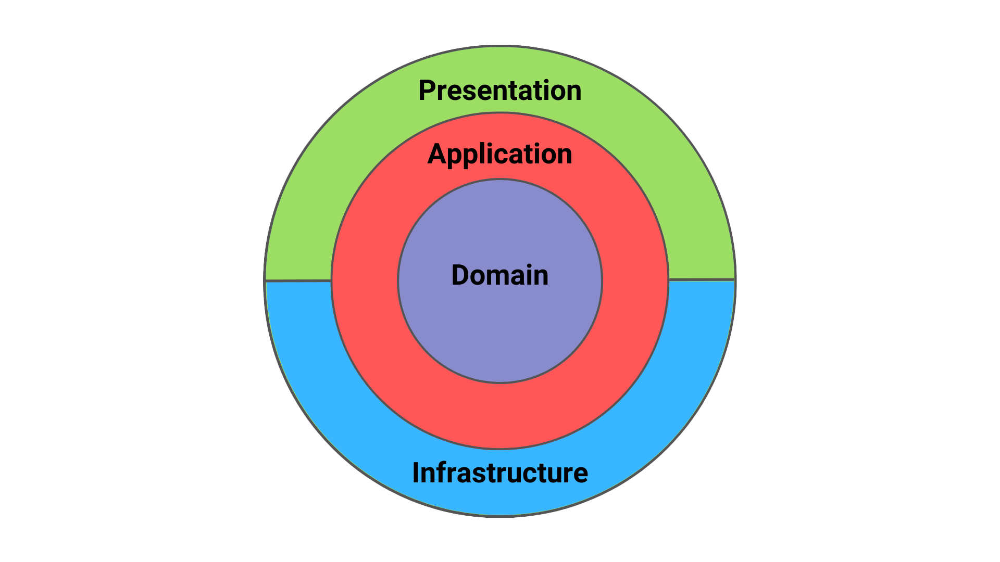
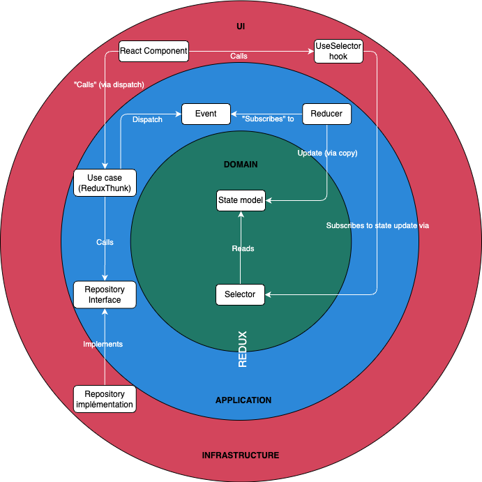
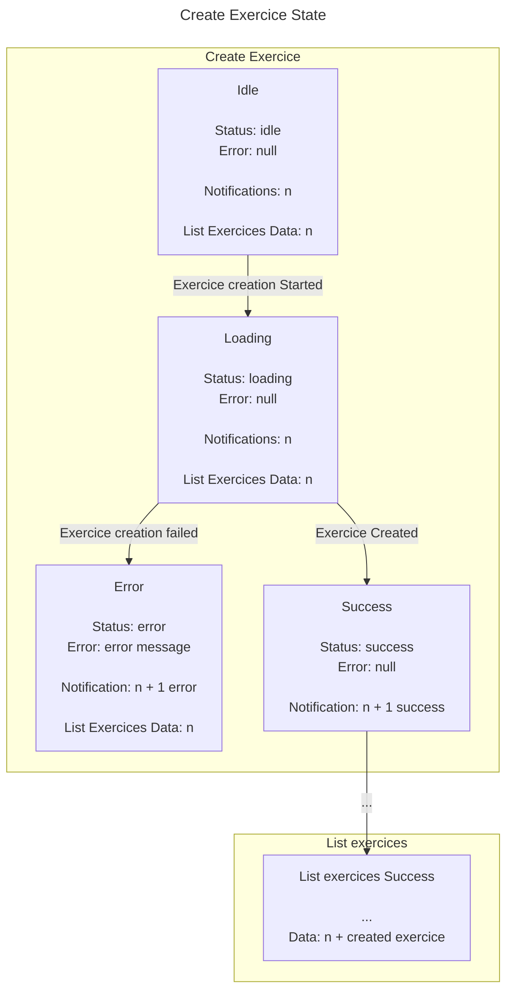
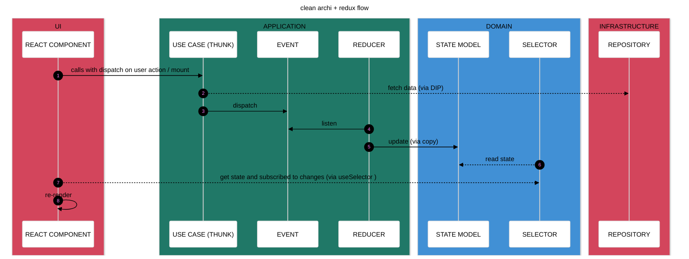
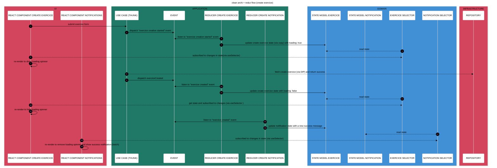

The purpose [of this repository](https://github.com/davidroberto/react-redux-clean-architecture-tdd-eda-vertical-slices) is to build a front end application with react, using the Clean Architecture, Event Driven Architecture, TDD and vertical slices principles.

This architecture have been showcased in the "[CTO InShape](https://www.youtube.com/channel/UCfRCkaIb9gEYVeFOsmYsylQ)" podcast during a pair programming session with [Mathieu Kahlaoui](https://www.linkedin.com/in/mathieu-kahlaoui/)! You can watch the podcast here: [CTO In Shape - Clean Architecture with Redux](https://www.youtube.com/watch?v=xA_ZL926tgY).


## Table of Contents

1. [Introduction](#intro)
2. [Issues with React and "classic" state management](#issues-react)
3. [Stack](#stack)
4. [Installation](#install)
5. [Clean architecture in front-end](#clean-archi)
6. [Redux](#redux)
7. [Dev methodology with TDD](#methodo)
8. [Execution flow](#execution-flow)
9. [DDD ?](#ddd)
10. [Vertical slices](#vertical-slices)
11. [Useful Ressources](#ressources)


## 1. Introduction  <a id="intro"></a>

This project is exploratory and aims to experiment with different ways to structure a front end application and use of TDD. It's my way of doing it and it can surely be better, so feel free to contribute, provide feedback or start PR if you have any ideas, suggestions, or believe something can be improved!

The React components and React Native screens **are not** the main focus of this project and have been kept simple. So you may still encounter some TODO items or TypeScript warnings / errors (even some "any", oops) in the UI layer. Also there is not test for react component.

<br />


## My issues with react without clean architecture and with "classic" react state management: <a id="issues-react"></a> 

- Feeling like I'm hacking things together to manage my components' state
- Struggling to decouple enough from the UI
- Creating/moving hooks and "services" here and there
- Difficulty to reason about the state and the transitions between states and get the big picture
- Overuse of hooks
- Having part of the business logic in the UI layer
- Failing to do TDD or test properly (too much coupling, too fragile, little logic to test...) and struggling to give value to those tests
- Switching from one state management library to another
- Trying to implement principles that don't fit well with React’s flow, ending up with overengineered solutions
- Having to reload the page to see state changes and replay scenarios
- Needing a backend to test scenarios and polluting the database with every manual test

## Stack <a id="issues-stack"></a>

| JS | TS   | React                                                          | Redux                                                          | React Native                                                          | Jest                                                           |
|---|------|----------------------------------------------------------------|----------------------------------------------------------------|-----------------------------------------------------------------------|----------------------------------------------------------------|
|  |  |     |    |  |  |


## Installation <a id="install"></a>

1. Fork this repository
2. Clone your forked repository
3. Install dependencies

```bash
  npm install
```

4. Run the app with expo

```bash
  npm run start
```

5. Run the unit tests

```bash
  npm run test
```


## Clean architecture in frontend: <a id="clean-archi"></a>

Clean architecture is often associated with back-end development. Using it on the front end is sometimes seen as overkill, because for a lot of people the frontend is easy. Maybe it was when SSR was the norm. But in a lot of projects using a separate frontend Single Page App (react, View, Angular etc), it's not the case anymore.

And implementing Clean Architecture is not necessary complex, and it can be very, very useful, event in frontend apps.

The main idea here is to separate the React component from the business logic and the data access. This way, we can develop and test the business logic without needing to open the browser or having to wait for a backend.

Imagine this user story: “**As a user, I want to create an exercise**.” 

The business logic is to create an exercise. The data access involves sending a fetch request to create an exercises. The React component is responsible for displaying an form and allowing the user to create a new exercise.


So we can already separate the code into three parts:

- The React component (UI)
- The business logic (use case)
- The data access (repository)

We can create a class or function called [CreateExerciseUseCase](https://github.com/davidroberto/react-redux-clean-architecture-tdd-eda-vertical-slices/blob/main/src/exercice/features/create-exercice/create-exercice.use-case.ts) that validates the data sent by the user and creates the exercise by calling the repository.
The repository contains the fetch function to actually create the exercise in the backend.

In practice, the UI calls the use case, and the use case calls the repository. Because the use case is coupled to the repository, it cannot be easily tested without sending a request to the backend.

To solve this, we can apply the Dependency Inversion Principle (DIP) and inject the repository into the use case via an interface ([here](https://github.com/davidroberto/react-redux-clean-architecture-tdd-eda-vertical-slices/blob/main/src/exercice/features/create-exercice/create-exercice.use-case.ts)). This way, we can mock the repository: either for developping the frontend without having a backend yet with a [in-memory implementation](https://github.com/davidroberto/react-redux-clean-architecture-tdd-eda-vertical-slices/blob/main/src/exercice/features/shared/infrastructure/exercice.repository.in-memory.ts) (useful for rapid Proof of Value), or in tests with [fakes](https://github.com/davidroberto/react-redux-clean-architecture-tdd-eda-vertical-slices/blob/main/src/exercice/features/shared/test/exercice-error.repository.fake.ts), allowing us to test the use case without actually making real requests.

Annnnd that’s it. We have a Clean Architecture approach in the frontend as the dependencies go inward.


[_(image from Milan Jovanović blog)_](https://www.milanjovanovic.tech/blog/clean-architecture-and-the-benefits-of-structured-software-design)

Please note that the layers here are not defined with traditional folders like application, domain, infrastructure, etc., but Clean Architecture principles are still respected. A vertical slices approach is used instead to gather nearly all the code related to a feature in one place ([here](https://github.com/davidroberto/react-redux-clean-architecture-tdd-eda-vertical-slices/tree/main/src/exercice/features/create-exercice)) and it's not contradictory to the Clean Architecture. As Robert C. Martin says: “_The architecture should scream the use cases of the application._” (Robert C. Martin).

But as the state was managed by React, it's still difficult to test the state changes and the transitions between states.
That's when Redux comes in.

<br />

### What about Redux? <a id="redux"></a>

To store data in our application (e.g., the logged-in user, a list of exercises, etc.), we need state. To share this state between components, we can use the Context API or a state management library such as Zustand, Recoil, or Redux. Redux has a reputation for having a lot of boilerplate and is sometimes considered overkill.

So why choose Redux?
Because Redux is not just a state manager. In this app, we use Redux and RTK for four main purposes:

1) State Management: to store the global application state.
2) (Kind of) Pub/Sub System / Synchronous event bus: In Redux we dispatch actions. This actions are "listened" by reducers in order to update the state accordingly. This part of Redux can be seen as a synchronous event bus. So in this repository, the actions dispatched by the use case are named "event" ([here](https://github.com/davidroberto/react-redux-clean-architecture-tdd-eda-vertical-slices/blob/main/src/exercice/features/create-exercice/create-exercice.events.ts)), because they feel more like it (in a event driven architecture style). 


[_image from Yazan Alaboudi Redux talk_](https://slides.com/yazanalaboudi/deck#/46)

3) Dependency Injection: By using the extraArgument option in the Redux store creation (using RTK configure store, [here](https://github.com/davidroberto/react-redux-clean-architecture-tdd-eda-vertical-slices/blob/main/src/shared/application/root.store.ts)), we can inject the repository (for data fetching, etc.) or any other infrastucture dependency into the use case ([here](https://github.com/davidroberto/react-redux-clean-architecture-tdd-eda-vertical-slices/blob/main/src/exercice/features/create-exercice/create-exercice.use-case.spec.ts)).
4) Middleware for Side Effects: Redux Thunk handles side effects such as API calls. Therefore, our use cases are implemented as Redux thunks, providing more granular control over how Redux actions (events) are dispatched related to the side effects ([here](https://github.com/davidroberto/react-redux-clean-architecture-tdd-eda-vertical-slices/blob/main/src/exercice/features/create-exercice/create-exercice.use-case.ts)).




**It's important to notice that Redux lives in our domain / application layers. It's not considered as an infrastructure tool, but as a core part of our application. It's a pragmatic choice for reducing the complexity.**

I feel like Redux perfectly fills the missing holes with Clean Architecture with React.
The event driven architecture which is enabled by Redux allows us to manage the state in a predictable way. And to think about state and transition without React in mind. That way, we can focus on the business logic and the state transitions, and test them without needing to open the browser. We can also modelize the state transitions with a state machine diagram, which is a great way to visualize the application flow, and using TDD to develop the use cases and state changes.
When done, we just need to plug in the React component. 

**So React is used only for what it was designed for: the UI.**


Please note that: 
- If other events related to another feature need to be dispatched after an event (e.g., creating an exercise triggers a new fetch of exercises), they are dispatched within the same use case. Because a use case does not calls another use case. And React component should not manage the application flow: it's not his responsibility call a use case after one is done.
- The state in this project is not normalized (using Normalizer for exemple) and the ui state is not separated from the "entity" state in the store (but it can be if the relational / nested data become is too complex)
- The selectors in this project are not created using createSelector (Reselect) because the data retrieved from the store is not derived or transformed


<br />

### My Dev methodology using TDD: <a id="methodo"></a>
1. Definition of the user story and scenarios for the feature. Example:
- As a user, I want to create an exercise
- Given no exercise is already created
- When the exercise creation starts
- Then the loading should be true
2.  Creation of a state machine diagram to visualize state transitions (directly in webstorm using [Mermaid](https://mermaid-js.github.io/mermaid/#/)):


3. Writing the first acceptance test based the scenario.  ([here](https://github.com/davidroberto/react-redux-clean-architecture-tdd-eda-vertical-slices/blob/main/src/exercice/features/create-exercice/create-exercice.use-case.spec.ts)): red
4. Implementation of the use case using baby steps (green)
5. Refactoring the code (refactor)
6. Writing a second acceptance test 

The unit tests here are usually socials (and can serve as specifications) in order to avoid fragile tests because of "behavior sensitivity" : test should change if the scenario change, not if the inner code change (check [the awesome Ian Cooper's "TDD Revisited" talk](https://www.youtube.com/watch?v=IN9lftH0cJc)).

In this repo, the use case is the starting point and it asserts against the current state with selectors.


### Execution flow: <a id="execution-flow"></a>


<br />


### Execution full flow exemple for create exercice use case (yeah it looks scary but it's not that bad):




<br />

### ~~DDD~~: <a id="ddd"></a>

I don't use the DDD tactical patterns in the front end, as business rules and invariant guarantees are handled by the backend (single source of truth). So i don't have entities, aggregates, value objects, etc. For validations is use simple validation services ([here](https://github.com/davidroberto/react-redux-clean-architecture-tdd-eda-vertical-slices/blob/main/src/exercice/features/create-exercice/create-exercice-validator.service.ts)) called within the use cases (or a validation lib in the react component).

<br />

### About vertical slices: <a id="vertical-slices"></a>

Each feature contains:
  - [The anemic state shape and the initial state](https://github.com/davidroberto/react-redux-clean-architecture-tdd-eda-vertical-slices/blob/main/src/exercice/features/create-exercice/create-exercice.state.model.ts) (domain model)
  - [The selectors](https://github.com/davidroberto/react-redux-clean-architecture-tdd-eda-vertical-slices/blob/main/src/exercice/features/create-exercice/create-exercice.state.model.ts) (to read the state from the store, like "getters")
  - [The reducers](https://github.com/davidroberto/react-redux-clean-architecture-tdd-eda-vertical-slices/blob/main/src/exercice/features/create-exercice/create-exercice.reducer.ts) (to listens to events and to update the state)
  - [The use case](https://github.com/davidroberto/react-redux-clean-architecture-tdd-eda-vertical-slices/blob/main/src/exercice/features/create-exercice/create-exercice.use-case.ts) (to call the repository and dispatch events)
  - [The Use case tests](https://github.com/davidroberto/react-redux-clean-architecture-tdd-eda-vertical-slices/blob/main/src/exercice/features/create-exercice/create-exercice.use-case.spec.ts)
  - [The State transition diagram](https://github.com/davidroberto/react-redux-clean-architecture-tdd-eda-vertical-slices/blob/main/src/exercice/features/create-exercice/create-exercice.state-machine.md) (state machine diagram)
  - [The events](https://github.com/davidroberto/react-redux-clean-architecture-tdd-eda-vertical-slices/blob/main/src/exercice/features/create-exercice/create-exercice.events.ts) (Redux actions created with createAction)
  - [A service validator](https://github.com/davidroberto/react-redux-clean-architecture-tdd-eda-vertical-slices/blob/main/src/exercice/features/create-exercice/create-exercice-validator.service.ts), if necessary (invariant is mostly handled by the backend)

Some files are shared between features:
  - The repository: [implementation](https://github.com/davidroberto/react-redux-clean-architecture-tdd-eda-vertical-slices/blob/main/src/exercice/features/shared/infrastructure/exercice.repository.in-memory.ts) + [interface](https://github.com/davidroberto/react-redux-clean-architecture-tdd-eda-vertical-slices/blob/main/src/exercice/features/shared/exercice.repository.interface.ts). I find it overkill to create a repository + repository interface per use case, manage its injection, etc, like it's sometimes done in Vertical Slices.
  - [The domain model type](https://github.com/davidroberto/react-redux-clean-architecture-tdd-eda-vertical-slices/blob/main/src/exercice/features/shared/exercice.state.model.ts)
  - [A reducer that combines each feature's reducers](https://github.com/davidroberto/react-redux-clean-architecture-tdd-eda-vertical-slices/blob/main/src/exercice/features/shared/exercice.reducer.ts)
    - Using combineReducer if each reducer operates on a separate portion of the state
    - OR using a custom utility composeReducers to merge reducers without creating a new state key if reducers operate on the same state portion (e.g., creating/deleting notifications)

<br />


## Useful ressources: <a id="ressources"></a>

- [Codeminer42 Blog "Scalable Frontend series"](https://blog.codeminer42.com/scalable-frontend-1-architecture-9b80a16b8ec7/)
- [Michel Weststrate's "UI as an afterthought" article](https://michel.codes/blogs/ui-as-an-afterthought)
- [Dan Abramov's "Hot Reloading with Time Travel" talk](https://www.youtube.com/watch?v=xsSnOQynTHs)
- [Dan Abramov's "The Redux Journey " talk](https://www.youtube.com/watch?v=uvAXVMwHJXU)
- [Michaël Azerhad's Linkedin posts about Redux](https://www.linkedin.com/in/michael-azerhad/)
- [Lee Byron's "Immutable Application Architecture" talk](https://www.youtube.com/watch?v=oTcDmnAXZ4E)
- [Nir Kaufman's "Advanced Redux Patterns" talk](https://www.youtube.com/watch?v=JUuic7mEs-s)
- [Robin Wieruch's book "Taming state in react"](https://github.com/taming-the-state-in-react/taming-the-state-in-react?tab=readme-ov-file)
- [Facebook Flux presentation](https://www.youtube.com/watch?v=nYkdrAPrdcw&list=PLb0IAmt7-GS188xDYE-u1ShQmFFGbrk0v)
- [Yazan Alaboudi's "Our Redux Anti Pattern" talk](https://slides.com/yazanalaboudi/deck#/46)
- [Robert C. Martin's "Clean Architecture" book](https://blog.cleancoder.com/uncle-bob/2012/08/13/the-clean-architecture.html)
- [David Khourshid's "Robust React User Interfaces with Finite State Machines" article](http://css-tricks.com/robust-react-user-interfaces-with-finite-state-machines/)
- [David Khourshid's "Infinitely Better UIs with Finite Automata" talk](https://www.youtube.com/watch?v=VU1NKX6Qkxc)