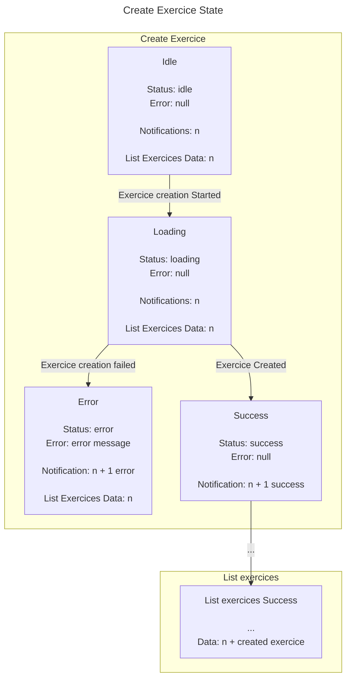

```mermaid
---
title: Create Exercice State
---

flowchart TD
    A[
        Idle

Status: idle
Error: null

Notifications: n

List Exercices Data: n
]

B[
Loading

Status: loading
Error: null

Notifications: n

List Exercices Data: n
]

C[
Error

Status: error
Error: error message

Notification: n + 1 error

List Exercices Data: n
]

D[
Success

Status: success
Error: null

Notification: n + 1 success
]


E[
List exercices Success

...
Data: n + created exercice
]

subgraph Create Exercice
A -->|Exercice creation Started|B
B -->|Exercice creation failed|C
B -->|Exercice Created|D
end

subgraph List exercices
D -->|...|E
end

```