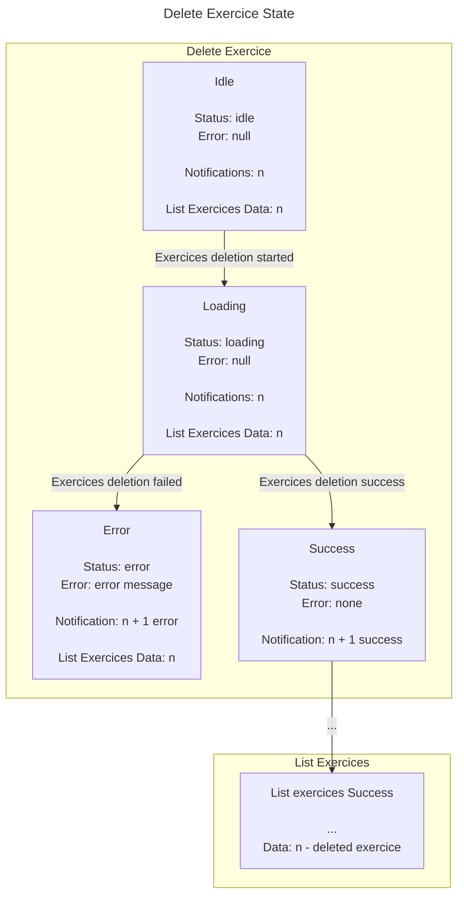

```mermaid
---
title: Delete Exercice State
---
flowchart TD
    
A[
    Idle
    
        Status: idle
        Error: null

        Notifications: n

        List Exercices Data: n
]

B[
    Loading
    
        Status: loading
        Error: null

        Notifications: n

        List Exercices Data: n
]

C[
    Error
    
        Status: error
        Error: error message
        
        Notification: n + 1 error

        List Exercices Data: n
]

D[
    Success
    
        Status: success
        Error: none
    
        Notification: n + 1 success
]

E[
    List exercices Success
    
        ...
        Data: n - deleted exercice
]

subgraph Delete Exercice 
    A -->|Exercices deletion started|B
    B -->|Exercices deletion failed|C
    B -->|Exercices deletion success|D
end

subgraph List Exercices
D -->|...|E
end

```
