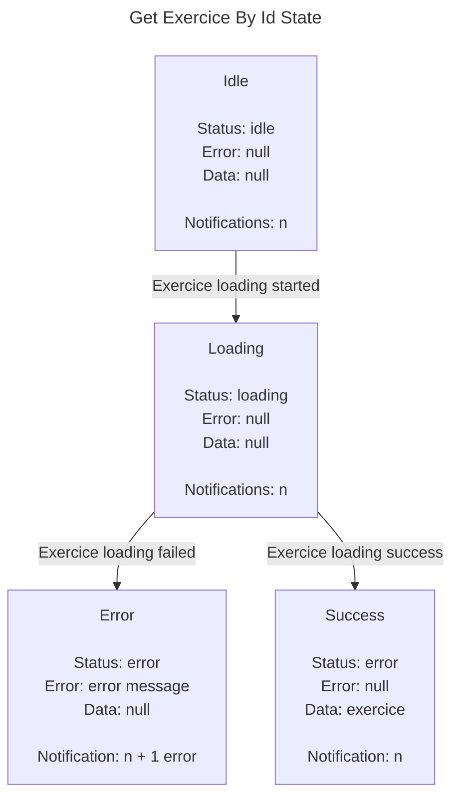

```mermaid
---
title: Get Exercice By Id State
---
flowchart TD

A[
    Idle
    
        Status: idle
        Error: null
        Data: null
        
        Notifications: n
]

B[
    Loading
    
        Status: loading
        Error: null
        Data: null
        
        Notifications: n
]

C[
    Error
    
        Status: error
        Error: error message
        Data: null
        
        Notification: n + 1 error
]

D[
    Success
    
        Status: error
        Error: null
        Data: exercice
        
        Notification: n
]

A -->|Exercice loading started|B
B -->|Exercice loading failed|C
B -->|Exercice loading success|D
```

