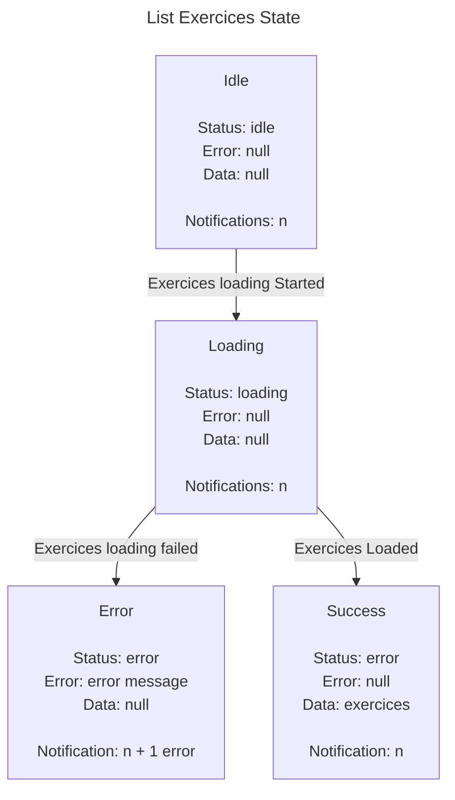

```mermaid
---
title: List Exercices State
---
flowchart TD
    
A[
   Idle
    
        Status: idle
        Error: null
        Data: null
    
        Notifications: n
]

B[
    Loading
    
        Status: loading
        Error: null
        Data: null
    
        Notifications: n
]

C[
    Error
    
        Status: error
        Error: error message
        Data: null
        
        Notification: n + 1 error
]

D[
    Success
    
        Status: error
        Error: null
        Data: exercices
    
        Notification: n
]

A -->|Exercices loading Started|B
B -->|Exercices loading failed|C
B -->|Exercices Loaded|D

```