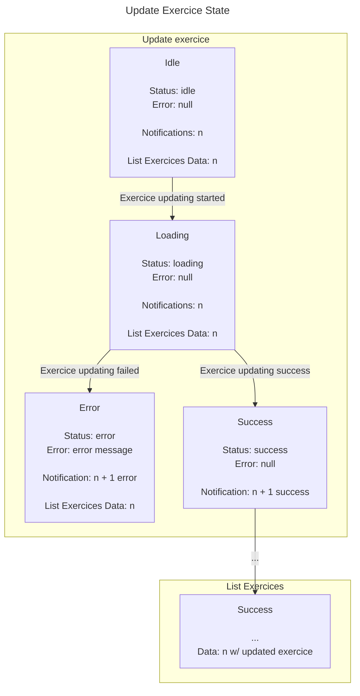

```mermaid
---
title: Update Exercice State
---
flowchart TD

A[
    Idle
    
        Status: idle
        Error: null
    
        Notifications: n

        List Exercices Data: n
]

B[
    Loading
    
        Status: loading
        Error: null
        
        Notifications: n

        List Exercices Data: n
]

C[
    Error
    
        Status: error
        Error: error message
    
        Notification: n + 1 error
        
        List Exercices Data: n
    ]

D[
    Success
    
        Status: success
        Error: null
    
        Notification: n + 1 success
]

E[
    Success
    
        ...
        Data: n w/ updated exercice
]

subgraph Update exercice
    A -->|Exercice updating started|B
    B -->|Exercice updating failed|C
    B -->|Exercice updating success|D
end

subgraph List Exercices
    D -->|...|E
end
```
