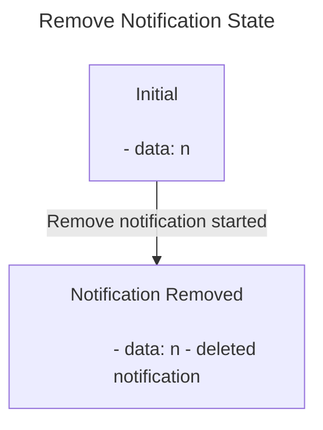

```mermaid
---
title: Remove Notification State
---

flowchart TD
    A[
        Initial
        
            - data: n
    ]

    B[
        Notification Removed
        
            - data: n - deleted notification
    ]

A -->|Remove notification started|B

```